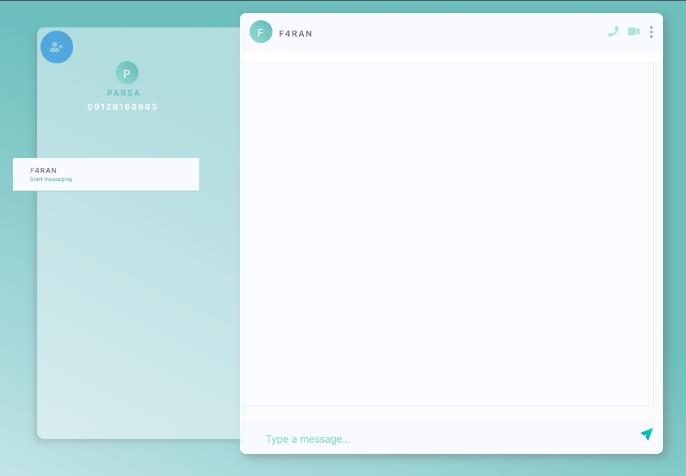
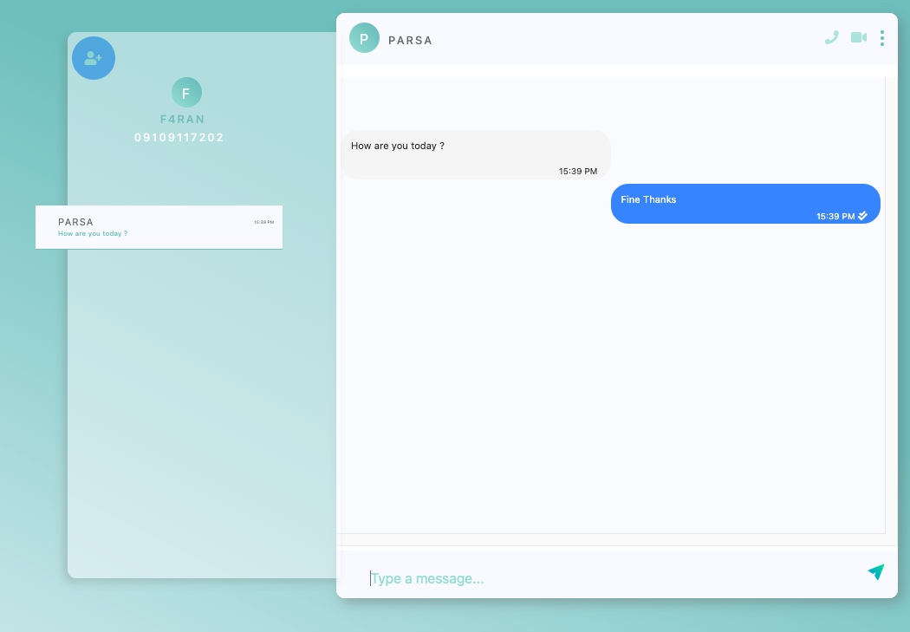
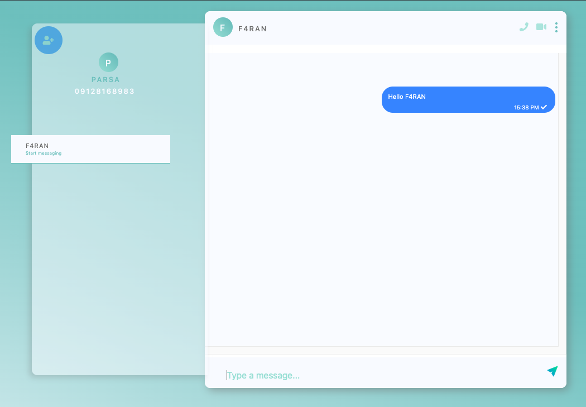
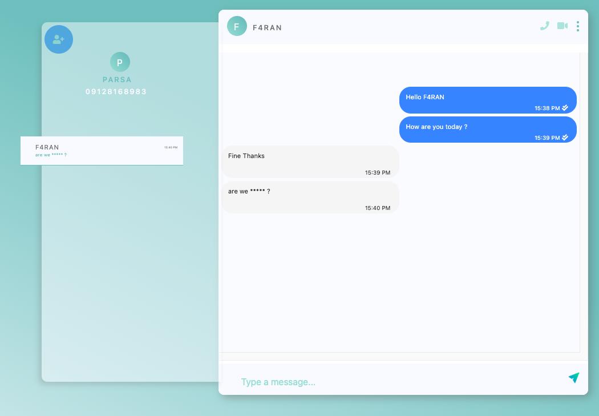
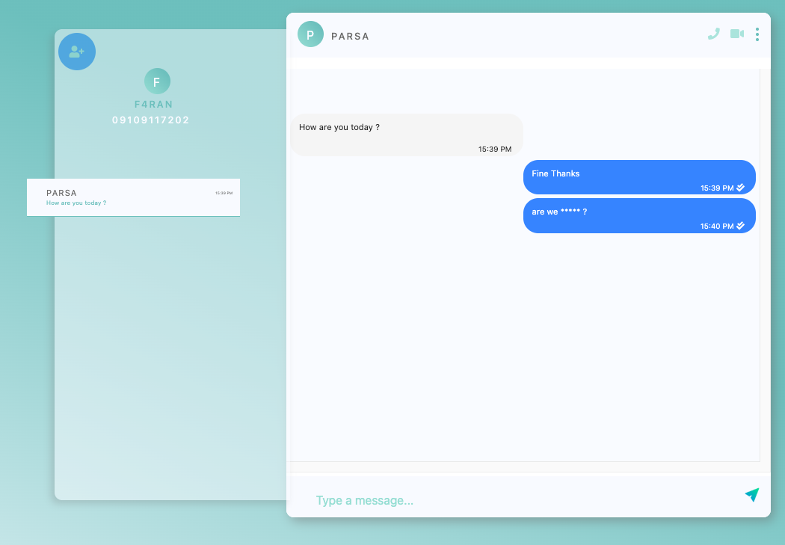

# Instant Messenger (Backend + Stream Processing)

Real‑time chat service with a web frontend and a backend that streams messages via Kafka. Built to demonstrate production‑grade event pipelines, scalable messaging, and a clean API surface.

## Screenshots


*Overall chat environment with friends list and active conversation*


*Direct messaging between two users in real time*


*Message delivery with status indicators (sent/seen)*


*Kafka-driven profanity filtering using words from `words.csv`*


*Filtered message in the sender side updated after stream processing*

## Features
- Real‑time one‑to‑one messaging with Socket.IO
- Message persistence and retrieval
- Stream processing pipeline (Kafka) for message filtering and spam detection
- JWT-based authentication with phone number registration
- Friend management and contact discovery
- Message status indicators (sent/seen)
- Offline message delivery
- Profanity filtering and spam detection
- Unread message counters
- Message history and chat persistence

## Tech Stack
- **Backend:** Python / Flask
- **Streaming:** Kafka (topic: `INSTANT`)
- **Storage:** MongoDB (messages, users, sessions)
- **Frontend:** Vue.js / Nuxt.js with Socket.IO
- **Real-time:** Socket.IO for WebSocket communication
- **Auth:** JWT tokens with cookie-based sessions

## Architecture
- Web (Vue/Nuxt) → API (Flask/Socket.IO)
- API writes to MongoDB and publishes to **Kafka**
- Kafka consumer handles message filtering, spam detection, and processing
- Web subscribes to real-time updates via Socket.IO WebSocket connection

## Getting Started

### Prerequisites
- Python 3.9+
- Node.js 16+
- MongoDB
- Kafka with Zookeeper

### Installation
```bash
git clone https://github.com/F4RAN/instant-messanger
cd instant-messanger

# Backend setup
pip3 install -r requirements.txt

# Frontend setup
cd ui
npm install
cd ..
```

### Running the Application

1. **Start MongoDB:**
```bash
# Option 1: Using brew services
brew services start mongodb-community

# Option 2: Manual start
mongod --config /opt/homebrew/etc/mongod.conf --fork
```

2. **Start Kafka & Zookeeper:**
```bash
# Terminal 1: Start Zookeeper
zookeeper-server-start /opt/homebrew/etc/kafka/zookeeper.properties

# Terminal 2: Start Kafka
kafka-server-start /opt/homebrew/etc/kafka/server.properties

# Terminal 3: Create topic
kafka-topics --bootstrap-server localhost:9092 --topic INSTANT --create --partitions 3 --replication-factor 1
```

3. **Start Application Services:**
```bash
# Terminal 4: Start Kafka consumer (for message filtering)
python3 kafka_consumer.py

# Terminal 5: Start Flask backend
python3 app.py

# Terminal 6: Start frontend
cd ui
npm run dev
```

4. **Access the Application:**
- Frontend: http://localhost:3000
- Backend: http://localhost:5000


## Configuration

**words.csv**: Contains filtered words list for profanity detection. Words in this file are automatically replaced with asterisks (*) in messages via the Kafka stream processing pipeline.

Environment setup:
```
# MongoDB Configuration
MONGO_HOST=127.0.0.1
MONGO_PORT=27017
MONGO_DB=instant_messenger

# Kafka Configuration  
KAFKA_BROKER=localhost:9092
KAFKA_TOPIC=INSTANT

# JWT Configuration
JWT_SECRET=very_secure_secret

# Flask Configuration
FLASK_PORT=5000
SECRET_KEY=secret!
```

## WebSocket API

Authentication:
```
register_user → {name, phoneNumber} → returns token
connect → requires ?token=<jwt_token> → returns user data or rejection
disconnect → close connection
```

Friend Management:
```
check_friend_phone → {token, phoneNumber} → add friend by phone
get_friends → requires ?token=<jwt_token> → returns friends list
```

Messaging:
```
send_message → {to, message, index} → sends message with spam detection
seen_message → {id} → mark specific message as seen  
seen_friend_message → <friend_id> → mark all messages from friend as seen
get_messages_history → requires ?token=<jwt_token> → returns chat history (last 10 per friend)
```

Events Received:
```
get_token → JWT token after registration
accepted → user data after successful connection
rejected → connection denied
receive_message → incoming message from friend
message_sent → confirmation of sent message
spam_detection → message blocked due to spam
friends_list → list of user's friends
messages_history → chat history data
double_check → message seen confirmation
friend_seen → friend has seen your messages
get_friend_info → friend lookup result
```	

## Roadmap

- Now (UX polish)
  - Typing indicators (ephemeral Socket.IO start/stop typing events)
  - Enhance read receipts (delivered vs read, timestamps, per-thread last seen)
  - Presence (online/offline with heartbeat pings)
  - Rate limiting on `send_message` to mitigate abuse

- Next (Search & history)
  - MongoDB text index on `content` and `created`
  - Search endpoint (WS/HTTP) with pagination
  - Tuned history retrieval (window per friend, server-side limits)

- Scale & reliability
  - Socket.IO Redis adapter + sticky sessions for horizontal API pods
  - Kafka multi-broker (replication factor ≥ 3), topic retention/compaction policies
  - Observability: structured logs, metrics, basic tracing

- Security
  - JWT secret rotation and refresh-token flow
  - Input validation and stricter CORS settings

- CI/CD & DevEx
  - GitHub Actions: lint/test (Python/Node), build UI, Docker image
  - Docker Compose for local stack; optional Dev Container

## License

MIT
